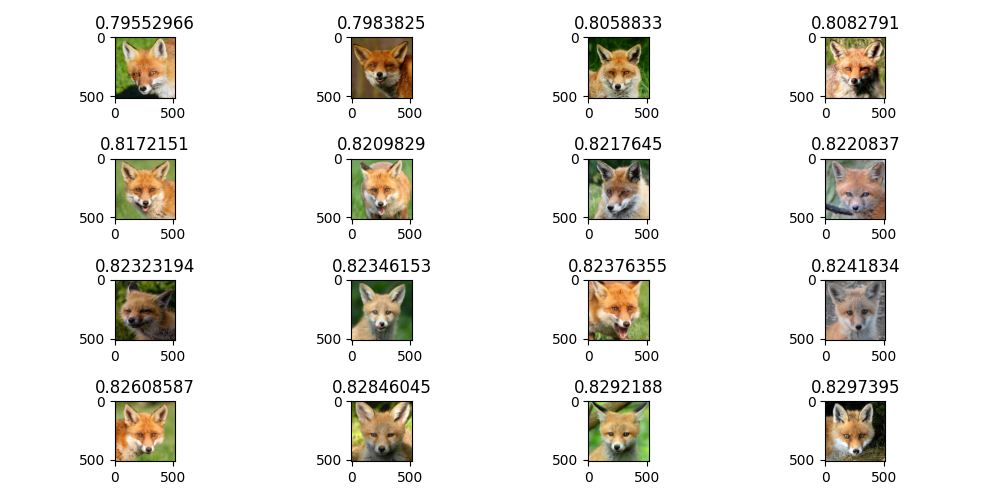

# Visual Search Engine

## Usage

1. Download the [dataset](https://www.kaggle.com/datasets/theaayushbajaj/cbir-dataset) and put it into a folder named `dataset`.
2. Install the necessary packages:
    ```sh
    pip install -r pkg.txt
    ```
3. Run `store_vectors.py` and wait for the program to generate two files: `vectors.pkl` and `paths.pkl`.
4. Place the image file you need to find similar images for in the `test` directory.
5. Run `search_img.py`.

## Input 
<div style="display: flex; justify-content: center">  
   
</div>

## Output
